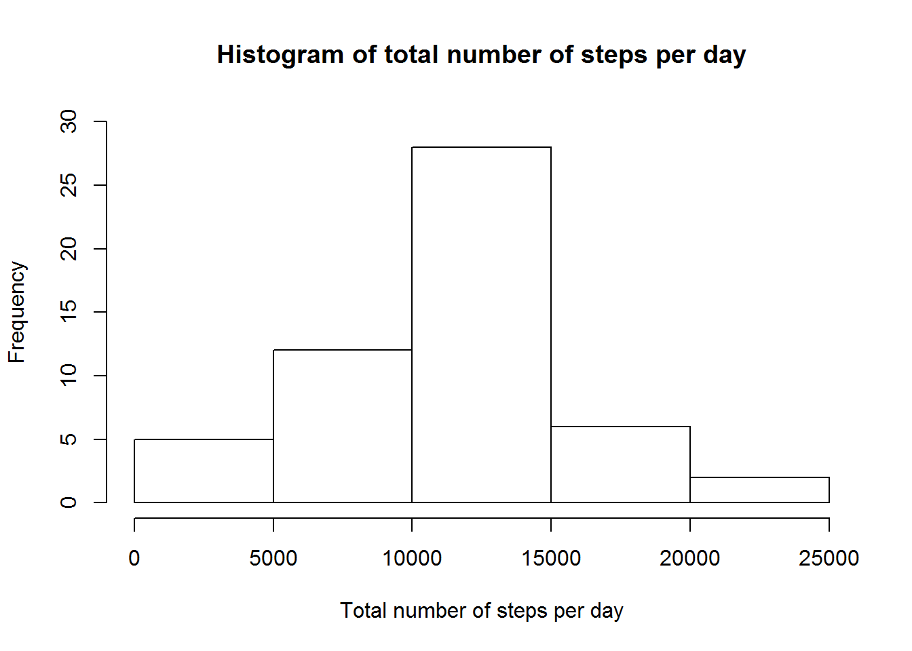
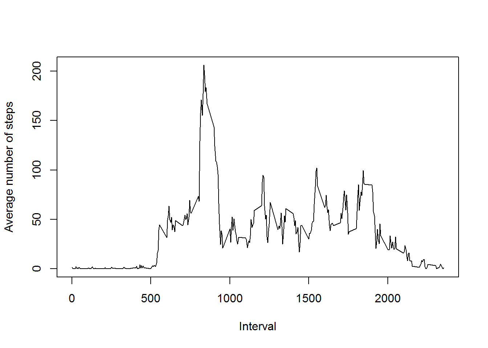
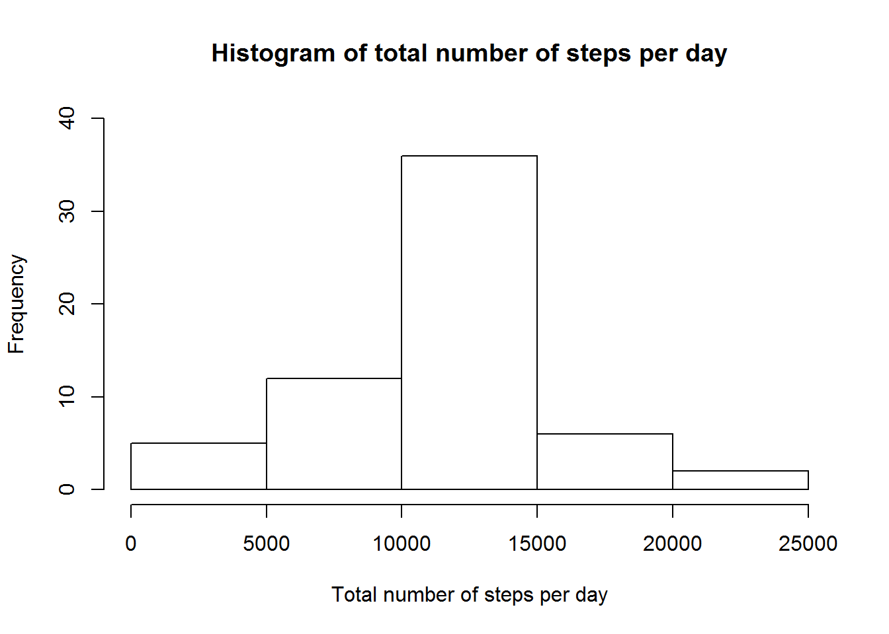
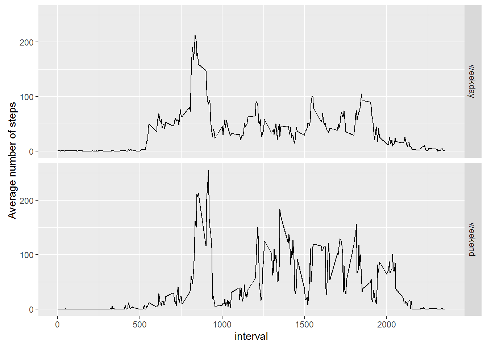

## Loading and preprocessing the data
Load the data.

```r
stepsdata <- read.csv("activity/activity.csv")
```

## What is mean total number of steps taken per day?
Calculate the total number of steps taken per day.

```r
totalsteps <- aggregate(steps ~ date, data = stepsdata, sum)
print(totalsteps)
```

```
##          date steps
## 1  2012-10-02   126
## 2  2012-10-03 11352
## 3  2012-10-04 12116
## 4  2012-10-05 13294
## 5  2012-10-06 15420
## 6  2012-10-07 11015
## 7  2012-10-09 12811
## 8  2012-10-10  9900
## 9  2012-10-11 10304
## 10 2012-10-12 17382
## 11 2012-10-13 12426
## 12 2012-10-14 15098
## 13 2012-10-15 10139
## 14 2012-10-16 15084
## 15 2012-10-17 13452
## 16 2012-10-18 10056
## 17 2012-10-19 11829
## 18 2012-10-20 10395
## 19 2012-10-21  8821
## 20 2012-10-22 13460
## 21 2012-10-23  8918
## 22 2012-10-24  8355
## 23 2012-10-25  2492
## 24 2012-10-26  6778
## 25 2012-10-27 10119
## 26 2012-10-28 11458
## 27 2012-10-29  5018
## 28 2012-10-30  9819
## 29 2012-10-31 15414
## 30 2012-11-02 10600
## 31 2012-11-03 10571
## 32 2012-11-05 10439
## 33 2012-11-06  8334
## 34 2012-11-07 12883
## 35 2012-11-08  3219
## 36 2012-11-11 12608
## 37 2012-11-12 10765
## 38 2012-11-13  7336
## 39 2012-11-15    41
## 40 2012-11-16  5441
## 41 2012-11-17 14339
## 42 2012-11-18 15110
## 43 2012-11-19  8841
## 44 2012-11-20  4472
## 45 2012-11-21 12787
## 46 2012-11-22 20427
## 47 2012-11-23 21194
## 48 2012-11-24 14478
## 49 2012-11-25 11834
## 50 2012-11-26 11162
## 51 2012-11-27 13646
## 52 2012-11-28 10183
## 53 2012-11-29  7047
```

Make a histogram of the total number of steps taken per day.

```r
hist(totalsteps$steps, xlab = "Total number of steps per day", main = "Histogram of total number of steps per day", ylim = c(0,30))
```



Calculate the mean and median of the total number of steps taken per day.

```r
mean(totalsteps$steps)
```

```
## [1] 10766.19
```

```r
median(totalsteps$steps)
```

```
## [1] 10765
```

## What is the average daily activity pattern?
Calculate the average number of steps for each 5 minute interval.

```r
intervals <- aggregate(steps ~ interval, data = stepsdata, mean)
```

Make a plot of the average number of steps for each 5 minute interval.

```r
plot(intervals$interval, intervals$steps, type = "l", ylab = "Average number of steps", xlab = "Interval")
```



Determine which 5 minute interval, on average, contains the maximum number of steps.

```r
intervals[which.max(intervals$steps),1]
```

```
## [1] 835
```

## Imputing missing values
Calculate the total number of missing values in the dataset.

```r
sum(is.na(stepsdata$steps))
```

```
## [1] 2304
```

Create a new dataset and fill in NA values with the mean for the 5 minute interval.

```r
NArem <- stepsdata
NArem$steps <- ifelse(is.na(NArem$steps), intervals$steps[match(NArem$interval, intervals$interval)], NArem$steps)
head(NArem)
```

```
##       steps       date interval
## 1 1.7169811 2012-10-01        0
## 2 0.3396226 2012-10-01        5
## 3 0.1320755 2012-10-01       10
## 4 0.1509434 2012-10-01       15
## 5 0.0754717 2012-10-01       20
## 6 2.0943396 2012-10-01       25
```

Make a histogram of the total number of steps taken per day.

```r
totalstepsNArem <- aggregate(steps ~ date, data = NArem, sum)
hist(totalstepsNArem$steps, xlab = "Total number of steps per day", main = "Histogram of total number of steps per day", ylim = c(0,40))
```



Calculate mean and median total number of steps taken per day.

```r
mean(totalstepsNArem$steps)
```

```
## [1] 10766.19
```

```r
median(totalstepsNArem$steps)
```

```
## [1] 10766.19
```

Using this strategy for filling in missing values had little impact on the estimates for the mean and median. The updated mean and median values for the total number of steps per day are within 1 step of the originally calculated values.

## Are there differences in activity patterns between weekdays and weekends?

Add a factor variable to the data set with missing values filled in to indicate whether the day was a weekday or weekend.

```r
condition <- weekdays(as.Date(stepsdata$date)) == "Saturday" | weekdays(as.Date(stepsdata$date[1])) == "Sunday"
NArem$day <- ifelse(condition, "weekend", "weekday")
```

Make a panel plot to compare average steps on a weekend and weekday.

```r
weekends <- aggregate(steps ~ interval + day, data = NArem, mean)
library(ggplot2)
qplot(interval, steps, data = weekends, geom = "line", ylab = "Average number of steps", xlab = "interval") + facet_grid(day ~ .)
```



